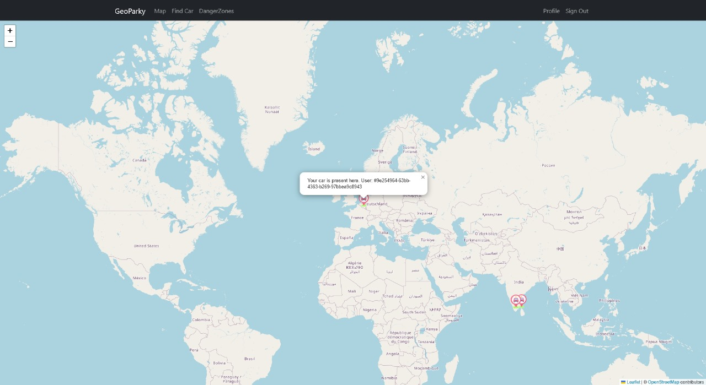
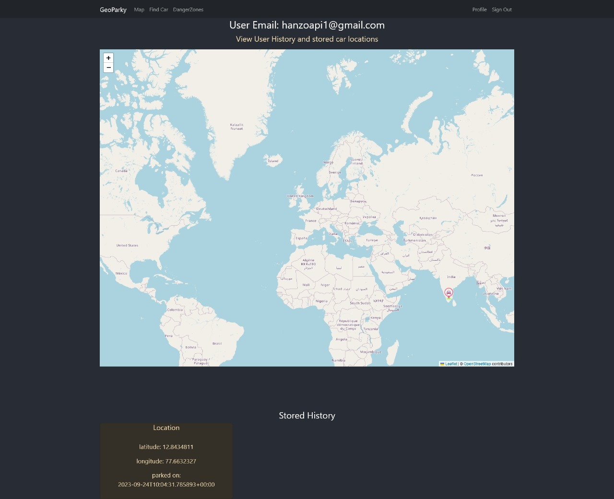
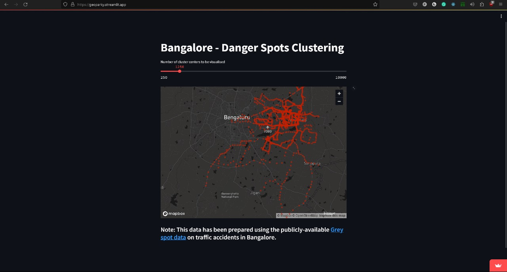

# Geoparky
Submission to [TransportHacks](https://transport-hacks.devpost.com/).

## Installing the dependencies
For the react app, run 
```
npm install
```

Also, create a `.env` file and populate it as follows:
```
REACT_APP_redisURL="redis_cloud_url"
REACT_APP_redisPassword='redis_cloud_password'
REACT_APP_supabaseURL="supabase_url"
REACT_APP_supabaseKey="supabase_api_key"
```

For the python API, run
```
pip install -r requirements.txt
```

---
## Running the app
To start up the frontend, run
```
npm start
```

To run the Redis API, run
```
cd geoparky-redis-api/
uvicorn redis_api:app
```

To run the Streamlit visualisations, run
```
cd streamlit-map-visualisations/
streamlit run app.py
```

---
## Visalisations
Map showing all actively parked vehicles.


Profile page - scrapbook of all previously-visited locations.


Streamlit visualisation of dangerous points' clusters.
